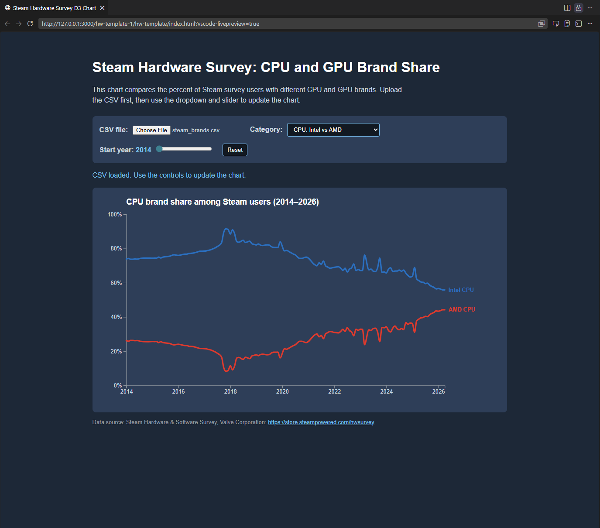
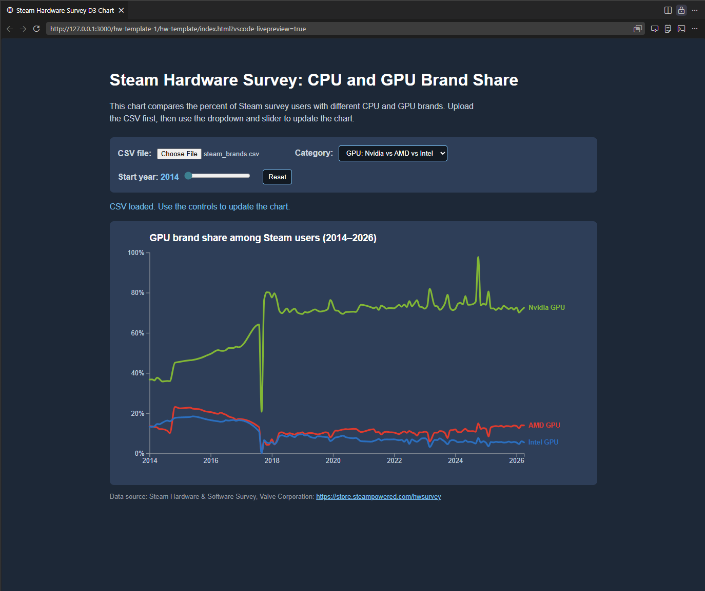

# Steam Hardware Brand Trends



## Project description

This project is a D3 multi-line chart that shows how Steam users' CPU and GPU brand choices have changed over time. The chart compares Intel and AMD CPU share with NVIDIA, AMD, and Intel GPU share among Windows users in the Steam Hardware Survey.

I chose this topic because Steam hardware data is interesting for understanding gaming hardware trends. CPU and GPU brand share can also show larger shifts in the PC gaming market, such as AMD gaining CPU share or NVIDIA continuing to dominate GPU usage.

## Visualization type

This project uses a multi-line chart. Each line represents one hardware brand category:

- CPU · Intel
- CPU · AMD
- GPU · NVIDIA
- GPU · AMD
- GPU · Intel

The x-axis shows time by year, and the y-axis shows the percentage of surveyed Steam users.

## Interaction

The visualization includes interaction so users can explore the data more easily. The chart uses HTML input controls and JavaScript event listeners to update the chart.

The interaction allows users to:

- Switch between CPU and GPU brand data
- Adjust the visible year range
- Reset the chart back to its original view

When the user changes the controls, the chart updates with a D3 transition instead of instantly changing.

## Updated chart after interaction



## Data source

The data comes from the public `jdegene/steamHWsurvey` dataset, which provides Steam Hardware Survey data in CSV format and includes historical survey data from Steam and Internet Archive snapshots: [jdegene/steamHWsurvey](https://github.com/jdegene/steamHWsurvey).

Steam describes its Hardware & Software Survey as an optional and anonymous monthly survey of users' computer hardware and software: [Steam Hardware & Software Survey](https://store.steampowered.com/hwsurvey/Steam-Hardware-Software-Survey-Welcome-to-Steam).

The CSV file used in this project is:

```text
steam_brands.csv
```

## How the data was prepared

The original Steam hardware data includes many detailed hardware categories. For this project, I used the CPU vendor category directly and grouped GPU model names into broader GPU brands.

For example:

- NVIDIA GPU models were grouped as `GPU · NVIDIA`
- AMD and Radeon GPU models were grouped as `GPU · AMD`
- Intel, Iris, and Arc GPU models were grouped as `GPU · Intel`

This simplified the dataset so it could be shown clearly as a multi-line chart.

## Files included

```text
index.html
main.js
style.css
steam_brands.csv
README.md
Screenshot.png
Screenshot2.png
```

## D3 features used

This project uses several D3 features:

- `d3.csv()` or CSV parsing to load external CSV data
- `d3.timeParse()` to convert date strings into JavaScript dates
- `d3.scaleTime()` for the x-axis
- `d3.scaleLinear()` for the y-axis
- `d3.line()` to create the line paths
- `d3.axisBottom()` and `d3.axisLeft()` for the axes
- SVG `text` elements for the title, axis labels, and line labels
- JavaScript event listeners for interaction
- D3 transitions to animate chart updates

## Design choices

I used a Steam-inspired dark background with strong but limited accent colors so the chart lines stand out. I also labeled the lines directly at the end of each path instead of using a separate legend. This makes the chart easier to read because viewers do not have to constantly compare the line colors to a legend.

The y-axis stays fixed from 0% to 100% so the viewer can compare the CPU and GPU views honestly. I used brand-related colors for the lines, such as blue for Intel, red for AMD, and green for NVIDIA.

## How to run the project

To view the project locally:

1. Open the project folder in VS Code.
2. Install the Live Server extension if needed.
3. Right-click `index.html`.
4. Select `Open with Live Server`.

The project uses a file upload button for the CSV, open `index.html` and select `steam_brands.csv` from the page.

## References

- D3.js documentation: <https://d3js.org/>
- W3Schools JavaScript Events: <https://www.w3schools.com/js/js_events.asp>
- W3Schools HTML input tag: <https://www.w3schools.com/tags/tag_input.asp>
- Steam Hardware & Software Survey: <https://store.steampowered.com/hwsurvey/Steam-Hardware-Software-Survey-Welcome-to-Steam>
- jdegene Steam Hardware Survey dataset: <https://github.com/jdegene/steamHWsurvey>

## Reflection

One pattern I noticed is that Intel remains very strong in CPU share, while NVIDIA has a large lead in GPU share. However, the chart also shows that AMD has a visible presence in both CPU and GPU categories. This makes the visualization useful because it shows both dominance and competition in PC gaming hardware over time.
